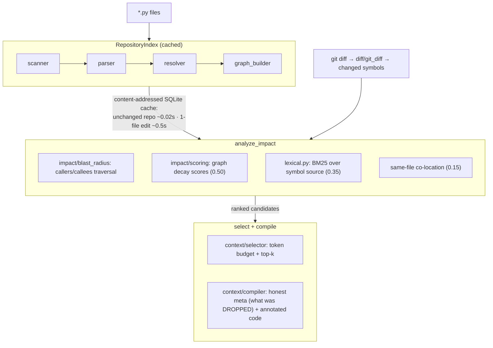

# Architecture — how DiffContext works

This is the full design walkthrough that used to live in the README. For
the 30-second version, see the [README](../README.md); for retrieval
methodology and numbers, see [BENCHMARKS.md](BENCHMARKS.md).

## Pipeline overview



Equivalent ASCII view:

```
                 ┌─────────────────────────────────────────────────┐
                 │              RepositoryIndex (cached)            │
   *.py files ──►│  scanner ─► parser ─► resolver ─► graph_builder  │
                 │     content-addressed SQLite cache (cache.py):   │
                 │     unchanged repo ~0.02s · 1-file edit ~0.5s    │
                 └───────────────────────┬─────────────────────────┘
                                         │
  git diff ─► diff/git_diff ─► changed symbols
                                         │
                 ┌───────────────────────▼─────────────────────────┐
                 │                 analyze_impact                   │
                 │  impact/blast_radius: callers/callees traversal  │
                 │  impact/scoring:  graph decay scores      (0.50) │
                 │  lexical.py:      BM25 over symbol source (0.35) │
                 │  same-file co-location                    (0.15) │
                 └───────────────────────┬─────────────────────────┘
                                         │  ranked candidates
                 ┌───────────────────────▼─────────────────────────┐
                 │              select + compile                    │
                 │  context/selector: token budget + top-k          │
                 │  context/compiler: honest meta (what was         │
                 │    DROPPED) + annotated code                     │
                 └──────────────────────────────────────────────────┘
```

## The six steps, in plain words

1. **Scan & parse.** Find every `.py` file, parse each one *once* into an
   AST, and extract every function/method as a `Symbol`.
2. **Resolve imports.** Turn `from auth.tokens import verify` — and
   `import black` under a `src/` layout, and re-exports through
   `__init__.py` — into actual file paths, so calls can be attributed to
   real definitions.
3. **Build the graph.** Who calls whom, who inherits from whom, who
   decorates whom — plus function references passed as *arguments*
   (`partial(fn, ...)`, `sorted(xs, key=fn)`), which are dependencies even
   though they're never "called" at that site.
4. **Cache everything.** The graph is persisted content-addressed (keyed
   by the hash of every file), so re-indexing an unchanged repo costs
   ~0.02s and editing one file re-parses only that file — verified equal
   to a from-scratch rebuild by the test suite.
5. **Score candidates.** Walk the graph outward from the changed
   function (scores decay with distance), blend with BM25 similarity and
   same-file bonus.
6. **Select & compile.** Pack the top-scoring functions into your token
   budget (default top-20 per changed symbol — the benchmarked sweet
   spot), and render with the honest meta header.

## Why three signals, blended

When a developer changes a function, the *other* code they end up touching
in the same commit tends to be related in one of three measurable ways:

1. **Connected in the call graph.** You changed `validate_jwt`; whoever
   *calls* `validate_jwt` might break, and whatever `validate_jwt` *calls*
   explains how it works. The strongest signal — but blind to related code
   that never calls yours.
2. **Lexically similar.** Two functions full of the same rare words
   (`refresh_token`, `jwks_cache`) are usually about the same thing, even
   with no call between them. BM25 finds these — but also ranks up noise
   that merely *sounds* similar.
3. **In the same file.** Code that lives together changes together. Weak
   but cheap, and it catches things the other two miss.

Each was benchmarked alone against real commit history (numbers in
[BENCHMARKS.md](BENCHMARKS.md)); each has a measurable blind spot, and the
hybrid — **graph 0.5 / BM25 0.35 / same-file 0.15**, the exact weights
that won recall on 4 of 5 benchmark repos — beats all three.
`--graph-only` turns the blend off when you want structural certainty only.

## Module map

```
diffcontext/
├── pipeline.py          # Orchestrator: index → impact → compile; hybrid blend
├── models.py            # Symbol, RepositoryIndex, ImpactResult, ContextPackage
├── scanner.py           # File discovery
├── parser.py            # AST symbol extraction
├── resolver.py          # Import → filesystem path resolution (src-layouts, re-exports)
├── symbols.py           # Attribute / local-var type tracking
├── graph_builder.py     # Dependency graph (calls, inheritance, decorators, fn-refs…)
├── lexical.py           # BM25 signal — pure stdlib, inverted index
├── cache.py             # Content-addressed SQLite persistence
├── diff/                # git diff / snapshot → changed symbols
├── impact/              # blast radius, scoring, traversal, terminal trees
├── context/             # token-budget selection, honest context compilation
├── languages/           # optional adapters (TypeScript/JS via tree-sitter)
└── cli/                 # index · impact · diff · compile · blast · verify
```

The public, semver-covered API is the `__all__` list in
[`diffcontext/__init__.py`](../diffcontext/__init__.py). Everything else is
importable but carries no stability guarantee across releases.

## What `compile` outputs (and why it's shaped that way)

`compile` doesn't just dump code. The output leads with a **meta header
that tells the model what it CANNOT see**:

```
=== DIFFCONTEXT META ===
Repo symbols total    : 648
Symbols IN context    : 18
Symbols DROPPED       : 630  ← you cannot see these
Graph confidence      : 100%  ✓
Context tokens (code) : 5,644
Output tokens (full)  : 7,012
...
DROPPED SYMBOLS (630) — scored but cut by token budget:
  - ./src/black/linegen.py:transform_line  (score: 71)
  ...
```

Every function in the body is annotated with its callers and callees, and
anything referenced but *not included* is tagged `[NOT IN CONTEXT]` — so
the model knows the difference between "this function doesn't exist" and
"this function exists but wasn't shown to me." That distinction is the
difference between an honest answer and a hallucinated one.

This honesty claim is stress-tested (see [BENCHMARKS.md](BENCHMARKS.md)):
at a tight 2,000-token budget, **0%** of the ground-truth functions
DiffContext failed to include were silently invisible — every single miss
was disclosed in the dropped manifest.

**Token accounting:** `--max-tokens` budgets the symbol *code*; the meta
header and caller/callee annotations add overhead on top, which is
reported honestly (`token_estimate` and the meta's `Output tokens (full)`
line cover the entire output) and auto-compacts under tight budgets so
meta can never dwarf the code it annotates.

## What the resolver handles

Asserted by the test suite on real resolved edges, not "it ran":
multi-hop attribute chains (`self.a.b.method()`), multiple inheritance and
cross-file MRO, circular imports, local-variable instantiation in free
functions, annotated-parameter receivers, import aliasing, sibling-directory
bare imports, decorator wrapper attribution, `src/`-layout packages
(`import black` resolving to `src/black/`), module-attribute calls through
package re-exports (`black.parse_ast()` → `black/parsing.py`), dotted module
calls (`import a.b; a.b.fn()`), and function references passed as arguments
(`functools.partial(fn, ...)`, `sorted(xs, key=fn)`) with parameter-shadowing
guarded against.

## Using it from an agent harness (incremental API)

Built to be called on every agent-loop iteration — repeat calls are cheap
and output is structured, not just a string:

```python
from diffcontext.pipeline import index_repository, analyze_impact, compile
from diffcontext import ScoringConfig

idx = index_repository("/path/to/repo")     # cold: full parse + graph build

# ... agent edits src/auth.py ...
idx.update(["src/auth.py"])                 # re-parses ONLY the changed file

impact = analyze_impact(idx, ["./src/auth.py:validate_jwt"],
                        scoring_config=ScoringConfig())    # weights tunable
ctx = compile(idx, impact, max_tokens=8000,
              token_counter=my_real_tokenizer)             # e.g. tiktoken

for item in ctx.items:       # structured: re-budget/filter/reorder yourself
    print(item.symbol_id, item.role, item.score, item.token_estimate)
```

Measured on pydantic (405 files, ~1,830 symbols): cold index ~2.6–4.2s;
re-index of an unchanged repo ~0.02s; `index.update()` after a one-file
edit ~0.4–0.6s vs ~1.6s full re-index — verified equal to a from-scratch
rebuild by the test suite. Stress-tested on a synthetic 1,500-file /
6,000-symbol repo: cold 3.7s, warm 0.14s, per-query impact+compile 0.15s.
